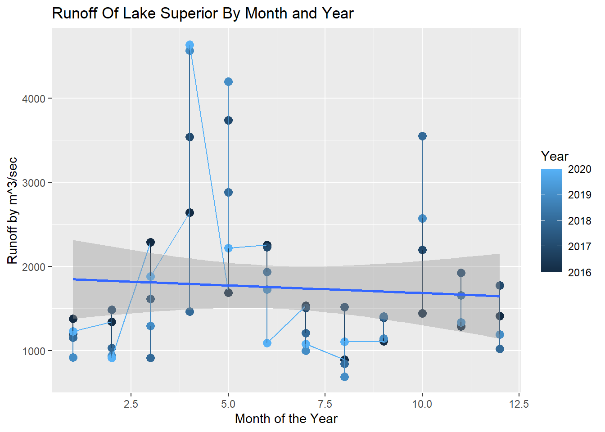

::: {.cell}

```{.r .cell-code}
library(DT)
library(pander)
library(tidyverse)
library(tidyr)
library(tidyquant)
library(ggplot2)
library(lattice)
library(readr)
library(dplyr)
library(stringi)
library(tidytext)
library(readxl)
library(rio)
library(stringr)
library(haven)
library(ggrepel)
library(ggthemes)
library(directlabels)
library(plotly)
library(gapminder)
library(hexbin)
library(lubridate)
library(riem)
library(sf)
library(geofacet)
library(leaflet)
library(leaflet.providers)
library(leaflet.extras)
```
:::


# Datasets


::: {.cell}

```{.r .cell-code}
# Natural ways Lake Superior has inflow and outflow
nat_sup <- read_excel("~/My Stat and Data Projects/Stats-Projects/My Datasets/Lake Superior Data.xlsx")

# Consumer Usage of lake
con_sup <- read_excel("~/My Stat and Data Projects/Stats-Projects/My Datasets/Sup Consumer (by year).xlsx")
```
:::


# Merge Dataset


::: {.cell}

:::


# Visualizations

## Evaporation


::: {.cell}

```{.r .cell-code}
ggplot(nat_sup, aes(x=Month, y=Evaporation, color=Year))+
  geom_point(size=3)+
  geom_line(aes(group = 1)) +
  geom_smooth(method = "lm", se = TRUE) +
  ggtitle("Evaporation Of Lake Superior By Month and Year")+
  labs(x="Month of the Year", y="Evaporation by m^3/sec")
```

::: {.cell-output .cell-output-stderr}

```
`geom_smooth()` using formula = 'y ~ x'
```


:::

::: {.cell-output .cell-output-stderr}

```
Warning: The following aesthetics were dropped during statistical transformation:
colour.
ℹ This can happen when ggplot fails to infer the correct grouping structure in
  the data.
ℹ Did you forget to specify a `group` aesthetic or to convert a numerical
  variable into a factor?
```


:::

::: {.cell-output-display}
{width=672}
:::
:::


## Precipitation


::: {.cell}

```{.r .cell-code}
ggplot(nat_sup, aes(x=Month, y=Precipitation, color=Year))+
  geom_point(size=3)+
  geom_line(aes(group = 1)) +
  geom_smooth(method = "lm", se = TRUE) +
  ggtitle("Precipitation Of Lake Superior By Month and Year")+
  labs(x="Month of the Year", y="Precipitation by m^3/sec")
```

::: {.cell-output .cell-output-stderr}

```
`geom_smooth()` using formula = 'y ~ x'
```


:::

::: {.cell-output .cell-output-stderr}

```
Warning: The following aesthetics were dropped during statistical transformation:
colour.
ℹ This can happen when ggplot fails to infer the correct grouping structure in
  the data.
ℹ Did you forget to specify a `group` aesthetic or to convert a numerical
  variable into a factor?
```


:::

::: {.cell-output-display}
{width=672}
:::
:::


## Runoff


::: {.cell}

```{.r .cell-code}
ggplot(nat_sup, aes(x=Month, y=Runoff, color=Year))+
  geom_point(size=3)+
  geom_line(aes(group = 1)) +
  geom_smooth(method = "lm", se = TRUE) +
  ggtitle("Runoff Of Lake Superior By Month and Year")+
  labs(x="Month of the Year", y="Runoff by m^3/sec")
```

::: {.cell-output .cell-output-stderr}

```
`geom_smooth()` using formula = 'y ~ x'
```


:::

::: {.cell-output .cell-output-stderr}

```
Warning: Removed 4 rows containing non-finite outside the scale range
(`stat_smooth()`).
```


:::

::: {.cell-output .cell-output-stderr}

```
Warning: The following aesthetics were dropped during statistical transformation:
colour.
ℹ This can happen when ggplot fails to infer the correct grouping structure in
  the data.
ℹ Did you forget to specify a `group` aesthetic or to convert a numerical
  variable into a factor?
```


:::

::: {.cell-output .cell-output-stderr}

```
Warning: Removed 4 rows containing missing values or values outside the scale range
(`geom_point()`).
```


:::

::: {.cell-output .cell-output-stderr}

```
Warning: Removed 1 row containing missing values or values outside the scale range
(`geom_line()`).
```


:::

::: {.cell-output-display}
{width=672}
:::
:::


## Consumer Usage


::: {.cell}

```{.r .cell-code}
ggplot(con_sup, aes(x=Year, y=Consumer, color=Year))+
  geom_point(size=3)+
  geom_line(aes(group = 1)) +
  geom_smooth(method = "lm", se = TRUE) +
  ggtitle("Consumer Usage Of Lake Superior By Year")+
  labs(x="Month of the Year", y="Consumer Usage by ft^3")
```

::: {.cell-output .cell-output-stderr}

```
`geom_smooth()` using formula = 'y ~ x'
```


:::

::: {.cell-output .cell-output-stderr}

```
Warning: The following aesthetics were dropped during statistical transformation:
colour.
ℹ This can happen when ggplot fails to infer the correct grouping structure in
  the data.
ℹ Did you forget to specify a `group` aesthetic or to convert a numerical
  variable into a factor?
```


:::

::: {.cell-output-display}
{width=672}
:::
:::


## Compare All


::: {.cell}

:::
